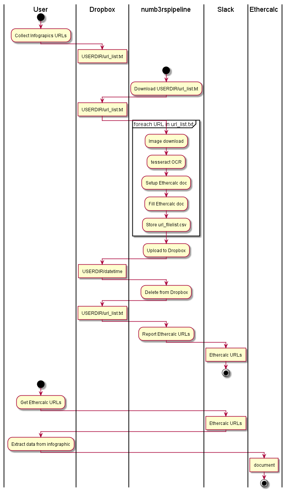
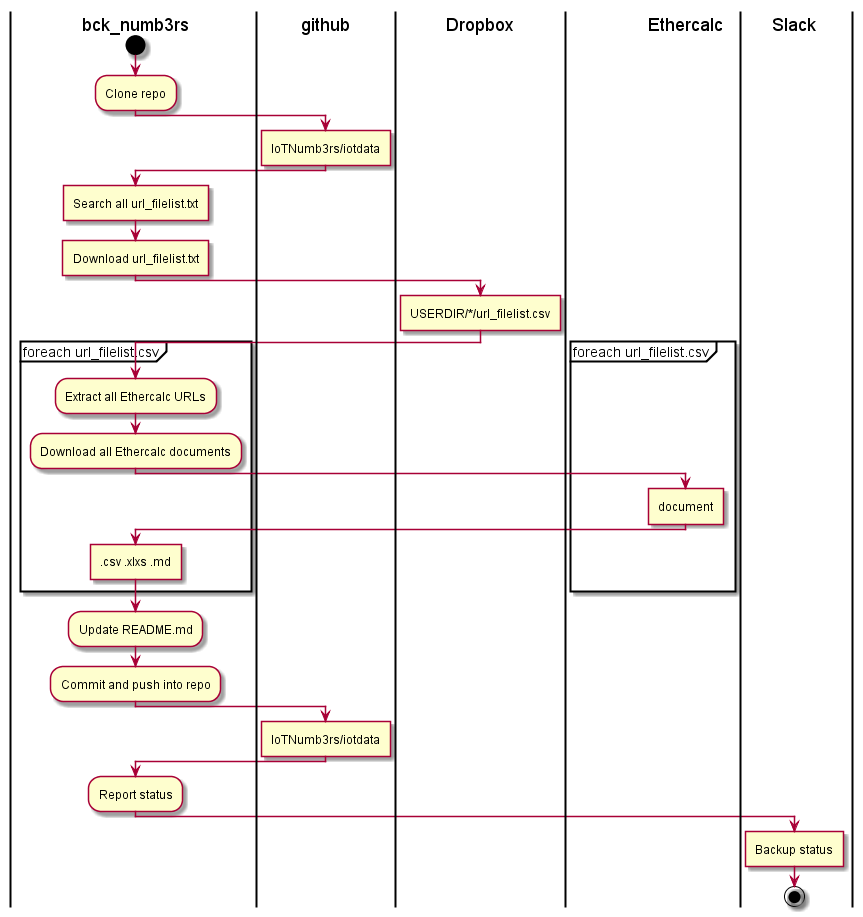

# System Design

In the IoTNumb3rs projects users extract IoT infographics figures and write them into [Ethercalc](https://www.ethercalc.org/) documents. The software components support this activity and collect periodically all data as csv files for further analysis.

IoTNumb3rs software consists of the following components.

| Component    | Purpose  |
| ------------- |:-------------:|
| numbe3rspipeline | Downloads users provided infographics and creates Ethercalc templates |
| bck_numb3rs   | Downloads all data from Ethercalc and stores them in GitHub |  
| bck_cleanup | Repeated data backup failed downloads.  |
| stats_numb3rs | Computes simple stats on the collected data. |  
| dq_numb3rs | Reports on various kinds of missing data |

All software activity is reported via [Slack](https://iotnumb3rs.slack.com/).

## numb3rspipeline

The project's workhorse is this pipeline. Users provide URLs to infographics via Dropbox and the numbe3rspipeline creates Ethercalc templates from them. Afterwards, users extract relevant figures from the infographics and fill out the template.

## bck_numb3rs

Periodically, this component collects the data from Ethercalc documents and stores them as .csv, .md and .xlxs files. Finally, the files are stored in the `iotdata` branch of this repo.

## bck_cleanup

The bcK_cleanup component repeats the download from Ethercalc for previously failed downloads during the run of bck_numb3rs. Updated files are stored in the `iotdata` branch of this repo.

## stats_numb3rs

Simple stats are computed on the collected data. The overall URL count and the distinct URL count are reported in `stats.csv` and pushed into  `iotdata` branch of this repo.

## dq_numb3rs

This component analyses the collected data from Ethercalc for missing data. The resulting quality indicator expresses the ratio of data rows with missing data to all data rows. It reports all info in `dq.md` and pushes the report into the `iotdata` branch of this repo. Users correct the data accroding to this report in order to increase the quality indicator.

